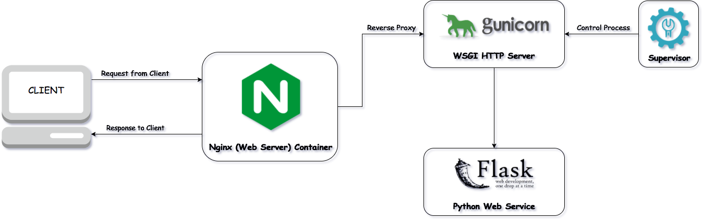
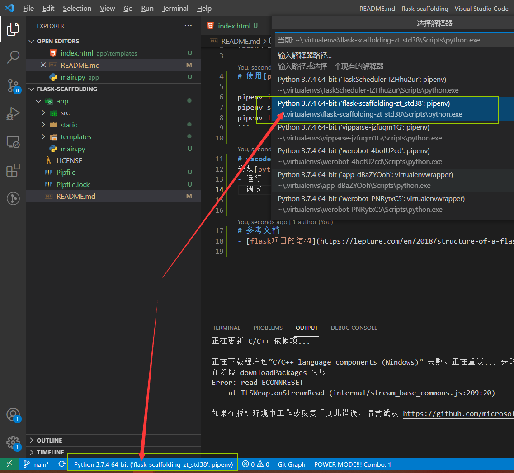
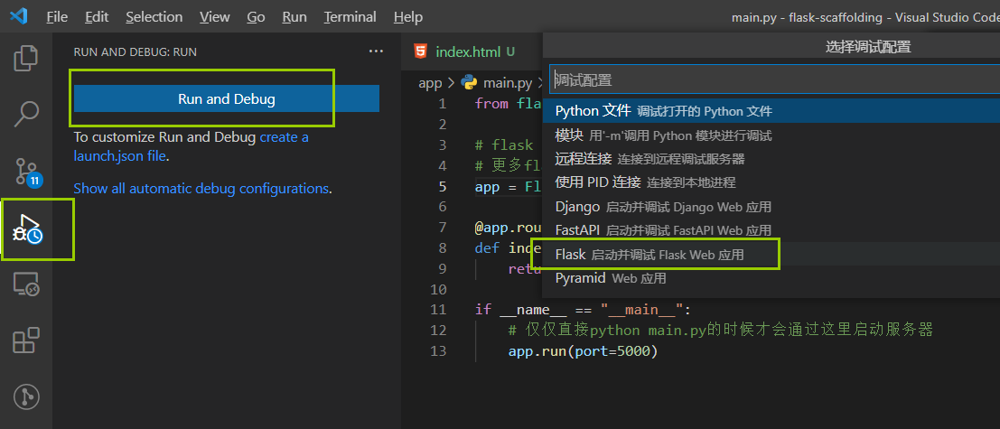
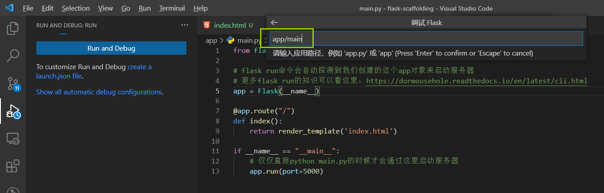
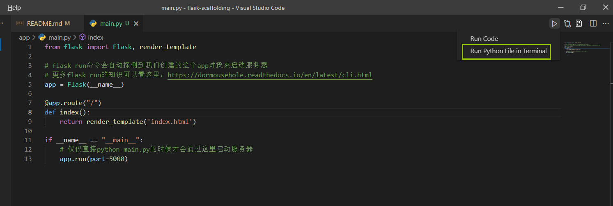

# flask-scaffolding

flask项目脚手架，可以基于此脚手架快速开发，减少重复操作，目前已经提供的能力：
- vscode作为开发IDE
- [pipenv](https://pipenv.pypa.io/en/latest/)管理开发环境
- 基于docker的nginx+gunicorn+supervisor一键部署
- migrations管理数据库迁移
- dotenv管理环境变量敏感信息
- 日志（支持在线预览）
- 开发/线上配置Config
- 规范的flask目录结构

使用步骤：
1. 根据文档描述配置开发环境
2. 根据需要初始化数据库（部署会尝试自动初始化数据库）
3. 开发/部署

下面是demo展示：

# 开发环境配置
## vscode作为开发IDE
1. 安装[python插件](https://code.visualstudio.com/docs/python/python-tutorial)

2. 在左下角切换python环境为pipenv创建的环境：
    
3. 调试运行：在左侧调试tab里可以通过Run and Debug来调试
    
    以flask方式运行时，需要指定我们flask app所在的python文件
    
    不想每次指定要运行的python文件可以create a launch.json来设置启动参数，注意环境指定：
    - FLASK_APP中指定的是业务逻辑上的环境（例如不同环境的数据库配置）
    - FLASK_ENV指定的是flask的环境（development环境会默认开启DEBUG模式），flask 1.0以后只能使用环境变量的方式配置环境
    DEBUG模式默认会启动debugger（发生错误时直接在网页中显示代码错误信息，并且可以直接shell调试），可以通过args中添加"--no-debugger"来关闭debugger
    ```
    {
    // Use IntelliSense to learn about possible attributes.
    // Hover to view descriptions of existing attributes.
    // For more information, visit: https://go.microsoft.com/fwlink/?linkid=830387
    "version": "0.2.0",
    "configurations": [
        {
            "name": "Python: Flask",
            "type": "python",
            "request": "launch",
            "module": "flask",
            "env": {
                "FLASK_APP": "app:create_app('development')",
                "FLASK_ENV": "development"
            },
            "args": [
                "run"
            ],
            "jinja": true
        }
    ]
}
    ```
4. 运行单个python文件：可以在python文件右上角直接run python file in terminal
    
## 使用[pipenv](https://pipenv.pypa.io/en/latest/)管理依赖
```
pipenv install  # 创建虚拟环境并安装依赖（只有第一次搭建环境需要安装）
pipenv shell  # 激活虚拟环境
pipenv lock -r > ./app/requirements.txt # 导出所有依赖到requirements
pip freeze > requirements.txt # 导出所有依赖到requirements (两种方法都可以)
```

## 数据库
### docker安装mysql（可选）
- 构建docker镜像
```
# 如果没有本地image则会自动下载
docker run --name mysql5.7 -p 4418:3306 -v ~/conf:/etc/mysql/conf.d -v ~/logs:/logs -v ~/data:/var/lib/mysql -e MYSQL_ROOT_PASSWORD=mysql123465 -d mysql/mysql-server:5.7
```
- 增加新用户
```
docker exec -it mysql5.7 bash
mysql -uroot -pmysql123465
use mysql;
grant all privileges on *.* to werobot@'%' identified by "mysql123465";
flush privileges;
```
- 创建数据库
```
create database werobot;
```

### 初始化数据库
使用[Flask-Migrate](https://github.com/miguelgrinberg/Flask-Migrate)管理数据库
- 第一次配置开发环境需要先执行以下命令初始化迁移文件，并生成表
```bash
# 默认在当前目录生成迁移文件夹migrations，可以通过-d选项来指定不同路径
# 如果设定了其它路径，后续命令都需要使用-d指定路径
flask db init  # 第一次初始化数据库升级环境（生成migrations目录，需要提交到代码仓库中纳入版本管理）
flask db migrate -m "Initial migration." # 更新数据库结构到migrations（-m可选）
flask db upgrade # 更新实际数据库（将migrations修改应用到实际数据库中，第一次执行会创建表）
```
- 后续开发过程中更改表结构只需要执行以下命令即可更新数据库
```
flask db migrate
flask db upgrade
```

# 部署
基于docker的nginx+gunicorn+supervisor部署：
- gunicorn：开启多进程基于gevent为flask提供wsgi服务
- nginx：反向代理，高效处理静态资源
- supervisor：进程管理，监控并自动重启nginx和gunicorn

安装好docker以后clone下代码来可以一键部署：
```bash
# 不带-d，调试用
# docker-compose up
docker-compose up -d

# 也可以直接执行提供的script来部署
./script/compose-deploy.sh
```

配置文件说明：
- gunicorn.conf.py：gunicorn配置文件：配置usgi服务的进程数，端口号等
- nginx_flask.conf：nginx配置文件：配置nginx反向代理的端口号等
- supervisord.conf：supervisor配置文件：配置supervisor如何监控&启动gunicorn和nginx
- Dockerfile：docker image配置文件，用于docker部署
- docker-compose.yaml：docker-compose配置文件，用于方便的部署docker
- requirements.txt：python依赖项，用于docker部署时安装依赖，一般开发完增加了依赖项的话需要重新生产该文件
- Pipfile：pipenv依赖配置，用于开发阶段的环境配置

## [安装docker](https://www.runoob.com/docker/centos-docker-install.html)
Docker支持以下的CentOS版本：

- CentOS 7 (64-bit)
- CentOS 6.5 (64-bit) 或更高的版本

### 前提条件
目前，CentOS 仅发行版本中的内核支持 Docker。

Docker 运行在 CentOS 7 上，要求系统为64位、系统内核版本为 3.10 以上。

Docker 运行在 CentOS-6.5 或更高的版本的 CentOS 上，要求系统为64位、系统内核版本为 2.6.32-431 或者更高版本。

### 使用 yum 安装（CentOS 7下）
Docker 要求 CentOS 系统的内核版本高于 3.10 ，查看本页面的前提条件来验证你的CentOS 版本是否支持 Docker 。

通过 uname -r 命令查看你当前的内核版本
```
uname -r 
```

### 安装 Docker
移除旧的版本：
```
sudo yum remove docker \
                  docker-client \
                  docker-client-latest \
                  docker-common \
                  docker-latest \
                  docker-latest-logrotate \
                  docker-logrotate \
                  docker-selinux \
                  docker-engine-selinux \
                  docker-engine
```

安装一些必要的系统工具：
```
sudo yum install -y yum-utils device-mapper-persistent-data lvm2
```

添加软件源信息：
```
sudo yum-config-manager --add-repo http://mirrors.aliyun.com/docker-ce/linux/centos/docker-ce.repo
```

更新 yum 缓存：
```
sudo yum makecache fast
```

安装 Docker-ce：
```
sudo yum -y install docker-ce
```

启动 Docker 后台服务:
```
sudo systemctl start docker
```

### 安装docker compose
```bash
#国内访问github太慢，可以使用镜像站 github.com.cnpmjs.org
#curl -L "https://github.com/docker/compose/releases/download/1.29.2/docker-compose-$(uname -s)-$(uname -m)" > /usr/bin/docker-compose
curl -L "https://github.com.cnpmjs.org/docker/compose/releases/download/1.29.2/docker-compose-$(uname -s)-$(uname -m)" > /usr/bin/docker-compose

chmod +x /usr/bin/docker-compose
```

# 常用命令
## pipenv
``` bash
pipenv install  # 创建虚拟环境并安装依赖（只有第一次搭建环境需要安装）
pipenv shell  # 激活虚拟环境
pipenv lock -r > ./app/requirements.txt # 导出所有依赖到requirements
pip freeze > requirements.txt # 导出所有依赖到requirements (两种方法都可以)
```
## 数据库
```bash
# 默认在当前目录生成迁移文件夹migrations，可以通过-d选项来指定不同路径
# 如果设定了其它路径，后续命令都需要使用-d指定路径
flask db init  # 第一次初始化数据库升级环境（生成migrations目录，需要提交到代码仓库中纳入版本管理）
flask db migrate -m "Initial migration." # 更新数据库结构到migrations（-m可选）
flask db upgrade # 更新实际数据库（将migrations修改应用到实际数据库中，第一次执行会创建表）
```

## docker
```bash
# 列出正在运行的容器
docker ps
# 进入容器
docker exec -it <container id> bash

# 后台运行docker并且不退出(dit)
docker run -dit -p 5000:80 --name=flask-scaffolding -v $(pwd)/app:/deploy/app flask-scaffolding

# 安装vim
apt-get update
apt-get install vim
```

## centos
```bash
# 安装rzls
yum -y install lrzsz
# 安装unzip
yum install zip unzip
```

# 参考文档
## 项目结构
- [flask项目的结构](https://lepture.com/en/2018/structure-of-a-flask-project)
- [Flask项目结构模板(主要参考这个)](https://www.justdopython.com/2020/01/18/python-web-flask-project-125/)
- [Flask 从入门到放弃6: 网站结构最佳实践(来自狗书第七章：大型程序的结构)](https://lvraikkonen.github.io/2017/08/28/Flask%20%E4%BB%8E%E5%85%A5%E9%97%A8%E5%88%B0%E6%94%BE%E5%BC%836:%20%E7%BD%91%E7%AB%99%E7%BB%93%E6%9E%84%E6%9C%80%E4%BD%B3%E5%AE%9E%E8%B7%B5/)

## 环境搭建
- [python vscode环境搭建](https://zhuanlan.zhihu.com/p/64994681)

## 数据库
- [使用 flask migrate 来迁移数据结构](https://einverne.github.io/post/2018/05/flask-migrate-tutorial.html)
- [flask_sqlalchemy增删改查](https://blog.csdn.net/Co_zy/article/details/77937195)

## 日志
- [flask写日志](https://blog.csdn.net/qq_36441027/article/details/111182467)
- [flask错误处理](https://dormousehole.readthedocs.io/en/latest/errorhandling.html)

## 部署
- [docker部署python](https://docs.docker.com/language/python/build-images/)
- [Deploy flask app with nginx using gunicorn and supervisor](https://medium.com/ymedialabs-innovation/deploy-flask-app-with-nginx-using-gunicorn-and-supervisor-d7a93aa07c18)
- [用docker部署flask+gunicorn+nginx](https://www.cnblogs.com/xuanmanstein/p/7692256.html)
- [部署Flask + uWSGI + Nginx(支持https)](https://blog.zengrong.net/post/deploy-flask-uwsgi-nginx/)
- [Flask后端实践 番外篇 Docker部署优化(docker-compose)](https://blog.csdn.net/qq_22034353/article/details/89950228)
- [docker和docker compose版本匹配](https://docs.docker.com/compose/compose-file/)

## docker部署mysql
- [使用Docker搭建MySQL服务](https://www.cnblogs.com/sablier/p/11605606.html)
- [探索Docker容器下MySQL的数据持久化](https://www.dazhuanlan.com/2019/10/18/5da8dc453e9f9/)
- [9个docker常见错误(发现了docker yml中不能访问volume映射的原因)](https://runnable.com/blog/9-common-dockerfile-mistakes)

## 其他
- [使用dotnev加载环境变量](https://github.com/theskumar/python-dotenv#readme)
- [flask处理ajax](https://blog.csdn.net/jinixin/article/details/80042763)
- [flask favicon.ico 404(浏览器默认行为，需要我们在html中指定icon的路径)](https://stackoverflow.com/questions/48863061/favicon-ico-results-in-404-error-in-flask-app)
- [Uncaught (in promise) DOMException: play() failed because the user didn't interact with the document first (chrome等浏览器不允许带声音的媒体自动播放)](https://developer.chrome.com/blog/autoplay/)
- [demo源码参考](https://github.com/JMWpower/xiaojiejie)
- [google-python命名规范](https://zh-google-styleguide.readthedocs.io/en/latest/google-python-styleguide/python_style_rules/#id16)
